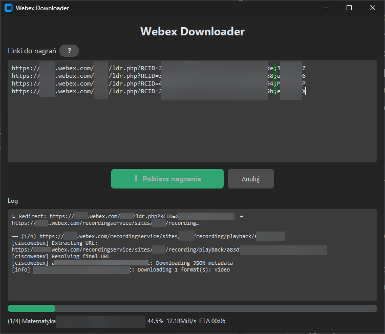

# Webex Downloader

Prosta aplikacja GUI do masowego pobierania nagrań z Webex. Obsługuje nagrania zabezpieczone hasłem.



## Funkcje

- **Ciemny motyw** — nowoczesny interfejs CustomTkinter
- **Hasła** — format `link;hasło` (średniki podświetlone na zielono)
- **Masowe pobieranie** — wklej wiele linków, jeden na linię
- **Pasek postępu** — verbose log + status `(5/20) Nazwa pliku`
- **Powiadomienia** — systemowe powiadomienie po zakończeniu
- **Self-contained .exe / .app** — nie wymaga Pythona ani yt-dlp

## Uruchomienie (dev)

```bash
pip install -r requirements.txt
python app.py
```

## Budowanie .exe (Windows)

1. Pobierz `ffmpeg.exe` + `ffprobe.exe` z [gyan.dev](https://www.gyan.dev/ffmpeg/builds/) i umieść w folderze projektu
2. Uruchom `build_win.bat`
3. Gotowy plik: `dist/WebexDownloader.exe`

## Budowanie .app (macOS)

1. `brew install ffmpeg` → `cp $(which ffmpeg) . && cp $(which ffprobe) .`
2. `chmod +x build_mac.sh && ./build_mac.sh`
3. Gotowa aplikacja: `dist/WebexDownloader.app`

## Format wejścia

```
https://firma.webex.com/rec/abc123;MojeHaslo
https://firma.webex.com/rec/def456
```

Jedna linia = jedno nagranie. Hasło po średniku (opcjonalne).
